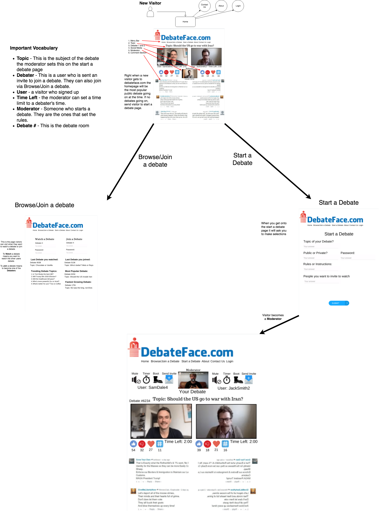

<!-- PROJECT LOGO -->
<br />
<p align="center">
  <a>
    
  </a>

  <h3 align="center">DebateFace</h3>

  <p align="center">
    Face-to-face debator's website using Janus webRTC Gateway.
    One moderator, two debators, and many participants.
    Cool features like kick, invite, mute or live chat.
    <br />
  </p>
</p>


<!-- TABLE OF CONTENTS -->
<details open="open">
  <summary>Table of Contents</summary>
  <ol>
    <li>
      <a href="#about-the-project">About The Project</a>
      <ul>
        <li><a href="#built-with">Built With</a></li>
      </ul>
    </li>
    <li>
      <a href="#getting-started">Getting Started</a>
      <ul>
        <li><a href="#prerequisites">Prerequisites</a></li>
        <li><a href="#installation">Installation</a></li>
      </ul>
    </li>
    <li><a href="#usage">Usage</a></li>
    <li><a href="#contributing">Contributing</a></li>
    <li><a href="#license">License</a></li>
    <li><a href="#contact">Contact</a></li>
  </ol>
</details>


<!-- ABOUT THE PROJECT -->
## About The Project



There are many great face-to-face video chatting platforms over the world, however, there aren't many free services that provide public debating rooms to any people.

Here's why Debateface is good:
* Anyone can be moderator or debator
* You can invite your friend or anyone to a debate room
* Moderator has several nice features
A list of commonly used resources that I find helpful are listed in the acknowledgements.

### Built With

* [Bootstrap](https://getbootstrap.com)
* [JQuery](https://jquery.com)
* [Laravel](https://laravel.com)
* [Janus](https://meetecho.com) 


<!-- GETTING STARTED -->
## Getting Started

### Prerequisites

This is an example of how to list things you need to use the software and how to install them.
* composer
  ```sh
  composer install 
  ```

### Installation

1. Install Xampp
2. Clone the repo
   ```sh
   git clone https://github.com/OliveSonDev/DebateFace.git
   ```
3. Install PHP packages by Composer
   ```sh
   composer install
   ```
4. Enter your DB credential in `.env` file
   
5. Run Laravel development server
   ```sh
   php artisan serve
   ```


<!-- USAGE EXAMPLES -->
## Usage

Use this space to show useful examples of how a video chatting room can be created / controlled.

_For more examples, please refer to the [Documentation](https://debateface.com)_


<!-- CONTRIBUTING -->
## Contributing

Contributions are what make the open source community such an amazing place to be learn, inspire, and create. Any contributions you make are **greatly appreciated**.

1. Fork the Project
2. Create your Feature Branch (`git checkout -b feature/AmazingFeature`)
3. Commit your Changes (`git commit -m 'Add some AmazingFeature'`)
4. Push to the Branch (`git push origin feature/AmazingFeature`)
5. Open a Pull Request


<!-- LICENSE -->
## License

Distributed under the MIT License. See `LICENSE` for more information.


<!-- CONTACT -->
## Contact

My Name - Olive - olivesondev@gmail.com

Project Link: [https://github.com/OliveSonDev/DebateFace](https://github.com/OliveSonDev/DebateFace)
